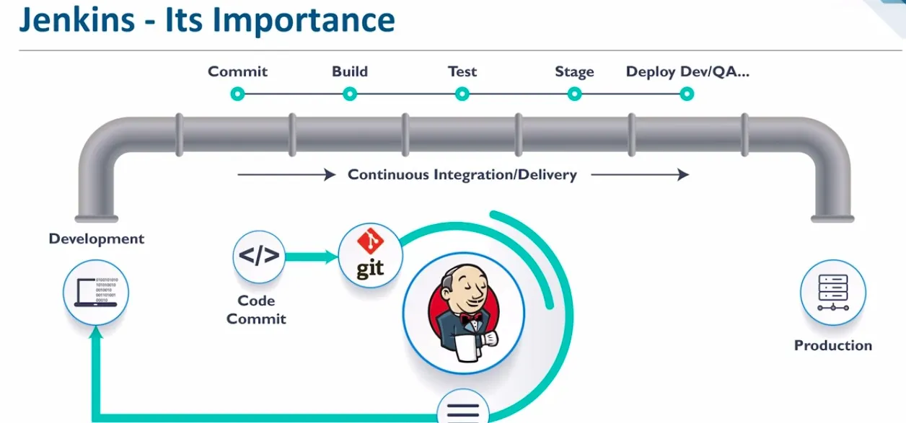
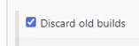
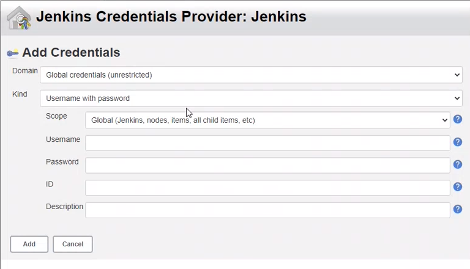

# CICD and Jenkins

## What is CI?
Merging various codes made by the team together into the master branch multiple times a day.

## What is CD?
Continuous delivery is making sure you can release new software or changes made to the customer quickly and sustainably.

## What is Jenkins?
Jenkins is an automation server which is free to use (open source) where the CI process happens.

## Why use Jenkins?
* Out of the other tools available below Jenkins is the only one free to use
* It has the best integration
* Available on most popular operating systems
* Easy installation
* Range of plugins
* Easy environment configuration

## What other tools are available?
* CircleCI
* TeamCity
* Bamboo
* GitLab

## Jenkins stages



* Commit
* Build
* Test
* Stage
* Deploy

## What is the difference between continuous delivery (CD) and continuous deployment (CD)?
* Deployment is completed manually in CD
* There is no human intervention in CDE if there are no errors
* If there are no errors then changes that are made are released straight to the customer and not to production in CDE

## Setting up Jenkins
1. First we need to log into Jenkins using the username and password provided to us by Shahrukh.
2. Next we want to select new item from the dashboard on the left to create a new item
3. We want to check that we are in the right time zone first
4. We name this item billy-checking-zone
5. Then select ```freestyle project``` and select ok
6. Make a description for this item - ```building a job to check time zone of this server```
7. Select this box below



8. Then enter 3 into max number of builds to keep
9. Scroll down and use the drop down for add build step
10. Select execute shell and type in ```date```
11. Nothing else needs to be changed for now so scroll down and click save
12. On the next page select build now from the dashboard
13. You should now see the below, if it is blue then it has been successful and if it is red then it failed


14. Now to check the time zone select the drop down next to ```#1``` and click on console output
15. At the bottom of the code you can see the date and time
16. To check you are on the right operating system (Ubuntu 18.04 or 20.04) you follow the same steps as above but name this item ```billy-os-check```
17. Create a description to match this
18. Follow all the steps above until you get to ```add build step```
19. This time in the execute shell we want to right ```uname -a``` to give us the operating systen name
20. Click save and then ```build now```
21. Do the same as before by going into the console output and at the bottom of the code you will see what operating system you are on. See example below


## Automating a job in Jenkins
We can automate the checking of the OS by doing the following
1. Go to your checking zone item, use the drop down and select configure
2. Go down to the bottom in the build section and select add post-build section
3. In this drop down select build other projects
4. Then tpye in the name of the os check item - billy-os-check
5. Leave the selection on ```trigger only if build is stable```
6. Then save
7. Click build now
8. Now you will have two parts in your build history
9. Select #2 and click on console output
10. You will see a message that says ```triggering a new build of billy-os-check```
11. Click that link and again use the buld history to check the console output
12. You should now see the operating system

## Linking GitHub to Jenkins to create a CI
1. First we need to generate a new SSH key pair but specifically for the repo that stores our app folder
2. Open a Git Bash terminal and cd into your .ssh location
3. Run the command ```ssh-keygen -t rsa -b 4096 -C billycooke329@gmail.com``` but change the email address to yours
4. You will then be prompted with ```enter a file in which to save the key``` which means what would you like to name it
5. I named it billy-jenkins-key
6. Then click enter twice to skip the passphrase
7. Use ```cat billy-jenkins-key.pub``` to view your public key
8. Copy this and head over to Git Hub
9. Go to the repo that holds your app folder, mine is in sparta_app_deployment
10. Go to settings in this repo and on the left select ```deploy keys```
11. Click add deploy key and name it the same as you named your key on Git Bash
12. Then paste in your public key
13. Now in Jenkins delete your previosuly made items
14. Create a new item called billy-CI and select freestyle project as normal
15. Create a description and follow the normal steps for discard old builds
16. Now select GitHub Project underneath discard old builds
17. You will be promoted to add your project url so go back to GitHub and go into your repo that contains the app folder
18. Select the green button code and copy the HTTPS url
19. Paste this into Jenknis
20. Then in office 365 connector select ```restrict where this project can be run``` and in label expression search for sparta-ubuntu-node which was alrrady made for us
21. Next select Git in source code management
22. We now need to add the SSH url in the repository url section in jenkins


23. Then in credentials select the add drop down and click jenkins
24. This will then pop up



25. Change kind from ```username with password``` to ```SSH username with private key```
26. Enter a username, billy-jenkins
27. Then select enetr directly under private key and click add
28. Go back to your Git Bash terminal and use ```cat billy-jenkins-key``` to reveal your private key
29. Copy this and paste it into the box below


30. Then click add
31. Now back at credentials search for your username that you just made and select that
32. Change the branch to main
33. Scroll down to build environment and select ```provide node & npm bin/ foler to PATH```
34. Then go down to add buld step, select execute shell and enter the command below


35. Then click save and build now
36. This will take slightly linger than before but you should see as normal  in build history that it was successful
37. In AWS this will have created multiple instances

## How to create a Webhook Trigger
1. Go to Git Hub
2. Go to your repo that contains your app folder
3. Go to settings and select webhooks from the dashboard
4. Add a webhook and copy the URL from Jenkins
5. Then go to Jenkins and go to billy-CI and go to configure
6. Go to job builds and select the git option
7. Then follow either of the steps below to make a change

## How to use a Webhook Trigger on Git Hub
1. Log into Jenkins
2. Go to billy-CI job
3. Make a change in your app code on Git Hub, just use a comment
4. Commit the change
5. A new job in build history will be triggered

## Testing it on Local- VS
1. Use Git Pull in VS
2. Make a change in your code, again make another comment
3. Git add, git commit and git push
4. A new job in build history will be triggered

## Creating a dev branch and merging to main branch
1. Create a new job in Jenkins called billy-ci-merge
2. We can use a template from the billy-ci that we made previosuly to fill out the page with what we have done before
3. In source code management change branches to build to dev as below


7. Then click save
8. In VS code use the command ```git branch dev``` to create a dev branch
9. Then use ```git chechout dev``` to go into that branch
10. Make a change to your README and then use the following commands
11. ```Git add .```
12. ```git commit -m "changes made"```
13. ```git push origin dev```
14. This how now pushed the changes to the dev branch onlu.
15. In Git Hub go to your repo and select your branch from the top left of the below


16. Select view all branches and then select the dev branch
17. You should be able to see the changes you made and if you check Jenkins another job has been created
18. If the tests have passed on Jenknis then we now need to merge the branches
19. Use the command ```git checkout main``` to go back to main branch
20. Then use ```git merge dev``` to merge them
21. Now use ```git push origin main``` to push the changes to main branch which will also trigger another job build

## How to automate the merging process
1. Follow the steps above up until step 7
2. Do not save just yet as we need to add more steps
3. Add the below in additional behaviours to state where to merge the branch


4. Scroll to the bottom and add a post-build action
5. Select git publisher and tick the following boxes


6. The post build actions states that the changes will nly be pushed to the main branch if the tests pass
7. Click save
8. Go back into your dev branc using ```git chechout dev``` and make a change to your README
9. Then use the below again
10. ```Git add .```
11. ```git commit -m "changes made"```
12. ```git push origin dev```
13. This will have created a new job build in jenkins and when is passess the checks it will merge with the main branch
14. You can check the console output to make sure everything has worked and you can also check the changes have also happened on your repo in Git Hub when you are in the main branch
15. Go to your billy-CI job and scroll to the bottom
16. In post-build actions add build other projects
17. Type in the job you would like to build, for example billy-ci-merge
18. Then save

## Pushing the code to production
1. Create an EC2 instance from your app AMI and make sure you allow the following ports 
* SSH on Jenkins port ```31.205.76.5/32```
* HTTP port 80
* SSH on my IP
* Port 3000
* Port 8080
2. Create a new job and name it billy-sparta-app
3. Configure it as below


4. The first few parts we have covered already however in build environment we added an SSH agent
5. The credentials were made for us under the name tech221-aws-keys
6. Then in build we added an execute shell and added the code in the image
7. This is basically copying over the app fodler from Git Hub oevr to our instance
8. Then it runs the app
9. All we need to do now is to get the public IP address from our instance and run it in a browser but add ```:3000``` to the end as we do not have a reverse proxy set up
10. The sparta app should then load